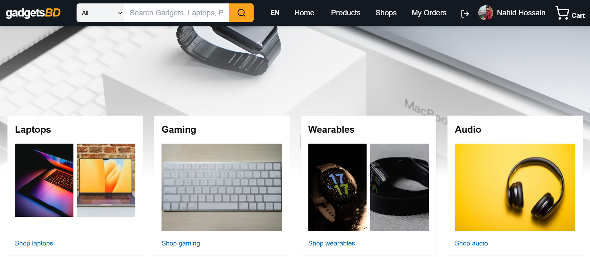
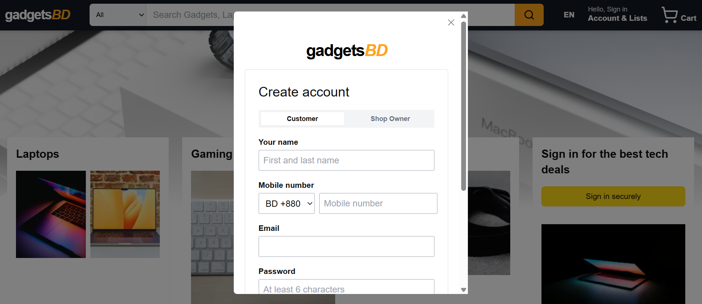
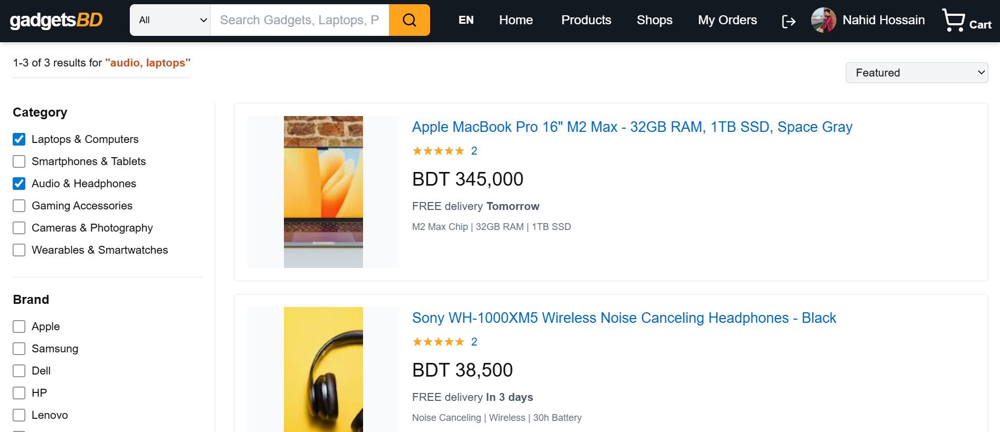
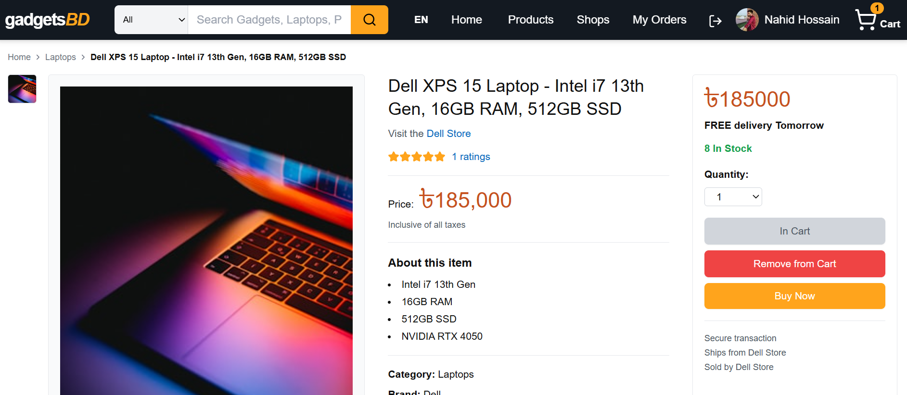
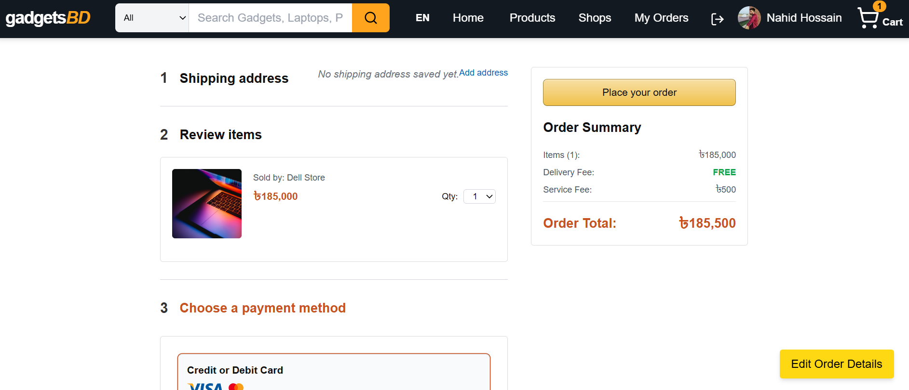
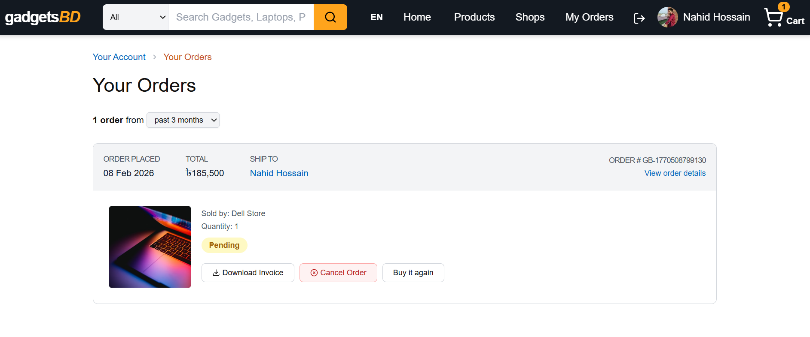

# 🛒 GadgetsBD — Modern E-Commerce Platform

GadgetsBD is a full-featured modern e-commerce platform built with a scalable architecture and real-world production patterns.  
The application supports **secure authentication**, **role-based access (User & Shop Owner)**, **product management**, **order lifecycle management**, **reviews**, **PDF invoicing**, and **email notifications** — all wrapped in a clean, responsive UI.

The platform simulates a real online marketplace where multiple shop owners can sell products and users can browse, purchase, review, and reorder gadgets seamlessly.

---

## 💻 Features

### 🔐 Authentication & Authorization
- Access Token & Refresh Token based authentication
- Secure login & registration using provided templates
- Social authentication: **Continue with Google**
- Forgot Password with email-based password reset
- Role-based access:
  - Normal User
  - Shop Owner

### 🧭 Advanced Routing
- Parallel Routing & Intercepting Routing
- Login/Register opens as a modal during navigation
- On page reload, Login/Register loads as a standalone page
- Product details support both modal and full-page views

---

## 🏪 Shop Owner Features
- Auto-redirect to Profile page after registration
- Update shop information and manage shop profile
- Add new products
- Manage own products:
  - Edit
  - Publish / Unpublish
  - Delete
  - Search & Filter
- View all orders placed on own products
- Update order status:
  - Pending
  - Confirmed
  - Shipped
  - Delivered
  - Cancelled

---

## 🛍️ User Features

### 🏠 Home Page
- Keyword-based product search with category selection
- Category shortcuts (Laptop, Smartphone, etc.)
- Category click auto-filters products page
- Featured Products section:
  - Shows products with highest purchases
  - Hidden if no purchase data exists
  - Add to Cart & Product Details supported
  - “View All” redirects to full product listing

### 📦 Products & Details
- Product gallery
- Category, product name, shop name
- Total ratings & average rating
- Description & stock quantity
- Add to Cart toggle
- Buy Now → Direct checkout
- Related products section
- Tabbed view:
  - Description
  - Reviews
  - Shop Info

### ⭐ Reviews System
- Only verified buyers can write reviews
- One review per user per product
- Logged-in user’s review appears first
- Edit & Delete own review
- Load More Reviews (5 at a time)

---

## 🛒 Cart & Checkout
- Cart accessible from Navbar
- Select products for checkout
- Edit cart items before checkout
- Proceed to Payment Process page

---

## 💳 Payment & Orders
- Fake payment simulation
- Order summary includes:
  - Products
  - Delivery address
  - Subtotal
  - Delivery fee
  - Service fee
  - Total amount
- Edit Order Details via modal
- Successful payment redirects to Success page

---

## 📄 Invoice & Email
- Automatic PDF invoice generation
- Invoice includes:
  - Company info
  - Customer info
  - Order details
  - Payment summary
- PDF invoice sent to user email after successful order
- Invoice downloadable from:
  - Success page
  - Orders page

---

## 📜 Orders & Booking History
- View all previous and current orders
- Download invoice
- Cancel order (if applicable)
- Write product reviews from order history
- Re-order products

### Role-based Orders View
- **Normal User**
  - Track order status
  - Download invoice
  - Review products
  - Re-order
- **Shop Owner**
  - View all received orders
  - Update order status

---

## 🧭 Shops
- Browse all registered shop owners
- Visit individual shop pages
- View all products from a specific shop

---

## 🧭 Navbar Behavior
- Common across all pages
- Guest user:
  - Sign In button
- Logged-in user:
  - Profile image & name
- Shop Owner menu:
  - Home
  - Add Product
  - Manage Products
  - Logout
- Normal User menu:
  - Home
  - Products
  - Shops
  - My Orders
  - Logout

---

## 🛠 Tech Stack
- Next.js (App Router)
- React.js
- Tailwind CSS
- MongoDB & Mongoose
- JWT (Access & Refresh Tokens)
- Google OAuth
- Node.js
- Email Service
- PDF Generation

---

## 📂 Project Structure

```
gadgetsbd/
├── app/
|   ├── (forgot-reset)
|   ├── (home)
|   ├── @auth
|   ├── actions
|   ├── api
|   ├── add-product
|   ├── cart
|   ├── context
|   ├── login
|   ├── manage-products
|   ├── oreders
|   ├── payment
|   ├── products
|   ├── profile
|   ├── register
|   ├── shops
|   ├── success
|   ├── layout.js
├── components/
│   ├── Navbar.jsx
│   ├── Footer.jsx
│   ├── Providers.jsx
│   └── ...other components
├── lib/
│   ├── invoice.js
│   ├── sendInvoiceEmail.js
|   ├── uplodadProductImage.js
|   ├── uploadToImageKit.js
│   └── token.js
├── models/
|   ├── user-model.js
|   ├── cart-model.js
│   └── ... other models
├── utils/
│   ├── data-utils.js
|   ├── email.js
│   └── slugify
├── package.json
└── tailwind.config.js
      

```


---

## 🚀 Getting Started
 
```bash
git clone https://github.com/nh-nahid/gadgetsBD.git
cd gadgetsbd

npm install
npm run dev

Open http://localhost:3000
to view the project.

Live url: https://gadgets-bd-nh.vercel.app/

```

## 📝 Usage

### 🔐 Authentication
- Users can register using email & password or **Continue with Google**.
- Login and registration open in a modal during normal navigation.
- Reloading the page shows login/register as standalone pages.
- Users can reset their password using the **Forgot Password** option via email.

### 🏠 Browsing Products
- Use the search bar on the Home page to search products by keyword and category.
- Click on any category from the Hero section to view filtered products.
- Featured Products display the most purchased items (if available).
- Click on a product title to view product details in a modal or full page.

### 🛍️ Product Details
- View product images, description, price, stock, ratings, and reviews.
- Add products to cart or click **Buy Now** to proceed directly to checkout.
- Browse related products from the same or similar categories.

### 🛒 Cart & Checkout
- Access the cart from the Navbar.
- Select products to checkout and update quantities.
- Proceed to checkout to review order summary and delivery details.
- Edit order details before payment using the Edit Order modal.

### 💳 Payment & Order Confirmation
- Complete checkout using the fake payment simulation.
- After successful payment, users are redirected to the Success page.
- View order summary and download the PDF invoice.
- Invoice is also sent automatically to the user’s email.

### ⭐ Reviews
- Only users who purchased a product can write a review.
- Each user can submit only one review per product.
- Users can edit or delete their own reviews.
- Use the Load More button to view additional reviews.

### 📜 Orders & Re-ordering
- View all past and current orders from the My Orders page.
- Download invoices, cancel eligible orders, and submit reviews.
- Use the Re-order option to purchase previously ordered products again.

### 🏪 Shop Owner Workflow
- Shop Owners are redirected to the Profile page after registration.
- Update shop details and manage product listings.
- Add new products or manage existing ones.
- View all orders placed on shop products and update order statuses.

### 🧭 Shops
- Browse all registered shops from the Shops page.
- Visit a shop to view all products listed by that shop owner.


## 🖼️ UI

| Home Page | Authentication Modal |
|:---------:|:--------------------:|
|  |  |

| Product Listing | Product Details |
|:---------------:|:---------------:|
|  |  |

| Checkout Process | Orders & Invoice |
|:----------------:|:----------------:|
|  |  |


## 🔮 Future Improvements

- Real payment gateway integration
- Admin dashboard
- Advanced analytics for shop owners
- Wishlist feature
- Multi-language support
- Performance optimizations

## 👨‍💻 Author

Nahid Hossain

- 💻 Passionate about building AI-powered web applications.
- 🎯 Focused on practical and interactive solutions.
- 🌱 Continuously exploring new technologies.

## 📄 License
&copy; All right reserved by GadgetsBD